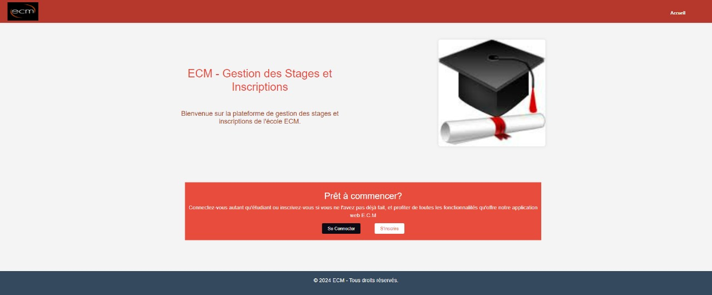
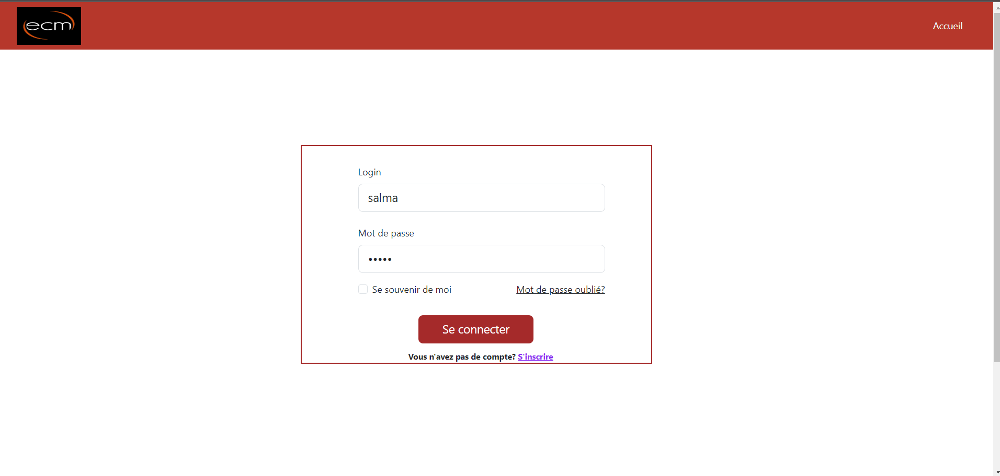
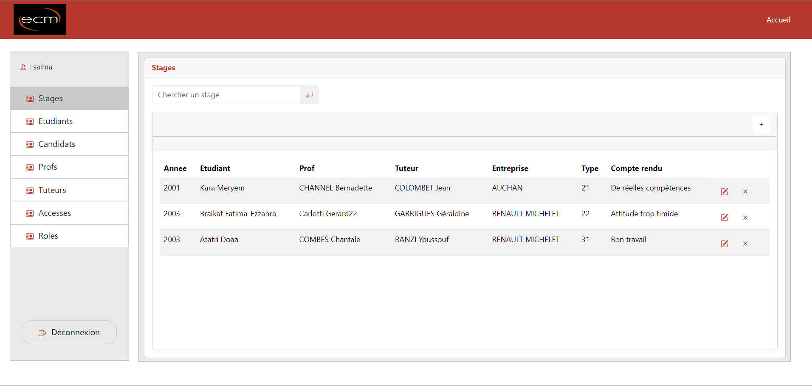
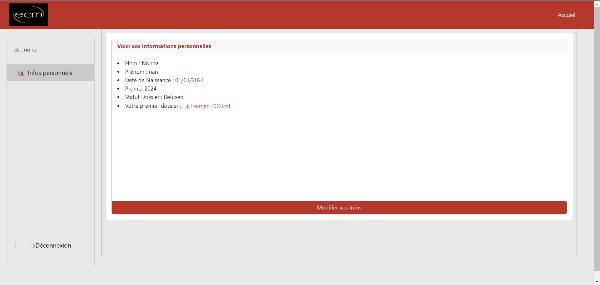
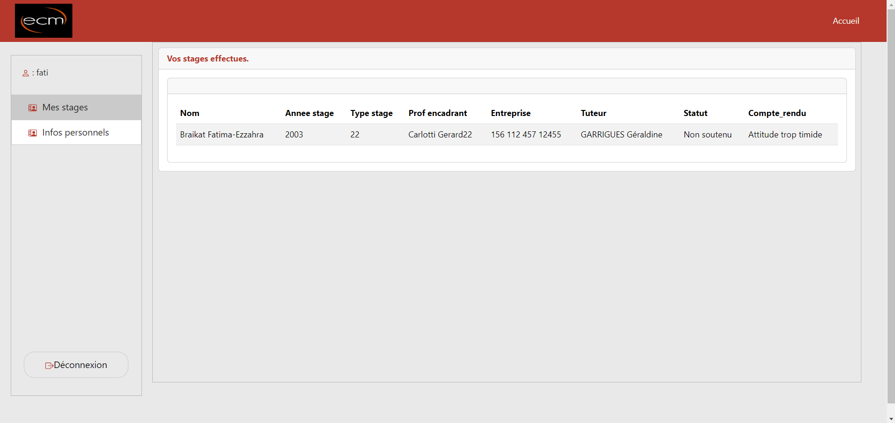

# Application frontend pour la gestion des élèves d'une école (ECM) et de leurs stages

# Backend
Pour voir la partie backend: 
https://github.com/Cristal32/projet_SI_gestion_ECM

# Table des matières

- [Code](#code)
  - [Framework](#framework) 
  - [Serveur de développement](#serveur-de-développement)
  - [Scaffolding du code](#scaffolding-du-code)
  - [Build](#build)
  - [Exécution des tests unitaires](#exécution-des-tests-unitaires)
  - [Exécution des tests end-to-end](#exécution-des-tests-end-to-end)
  - [Aide supplémentaire](#aide-supplémentaire)
- [Résultats - interfaces](#résultats---interfaces)
  - [Page d'accueil](#page-daccueil)
  - [Page de connexion](#page-de-connexion)
  - [Interface d'administration](#interface-dadministration)
- [Contributeurs](#contributeurs) 

# Code

## Framework

Angular 16.1.2 généré avec [Angular CLI](https://github.com/angular/angular-cli) 

## Serveur de développement

Exécuter `ng serve` pour lancer un serveur de développement. Accédez à `http://localhost:4200/`. L'application se rechargera automatiquement si vous modifiez l'un des fichiers sources.

## Scaffolding du code

Exécuter `ng generate component nom-composant` pour générer un nouveau composant. Vous pouvez également utiliser `ng generate directive|pipe|service|class|guard|interface|enum|module`.

## Build

Exécuter `ng build` pour construire le projet. Les fichiers de construction seront stockés dans le répertoire `dist/`.

## Exécution des tests unitaires

Exécuter `ng test` pour exécuter les tests unitaires via [Karma](https://karma-runner.github.io).

## Exécution des tests end-to-end

Exécuter `ng e2e` pour exécuter les tests end-to-end via une plateforme de votre choix. Pour utiliser cette commande, il faut d'abord ajouter un package qui implémente les capacités de test end-to-end.

## Aide supplémentaire

Pour obtenir plus d'aide sur Angular CLI, utiliser `ng help` ou consulter la page [Angular CLI Overview and Command Reference](https://angular.io/cli).

# Résultats - interfaces

## Page d'accueil

  

## Page de connexion

  

## Interface d'administration

  

## Interface du candidat

  

## Interface de l'étudiant

  

  

# Contributeurs

- [@Cristal32](https://github.com/Cristal32)
- [@dodoLR](https://github.com/dodoLR)
- [@fatibr19](https://github.com/fatibr19)
